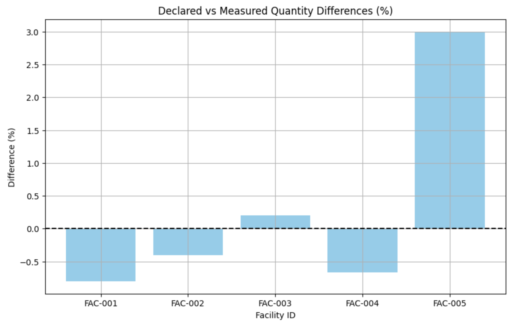

# Facility-Inspection-Analysis
Facility Inspection Reports (Mock Data) - Analysis of State declarations vs field measurements for nuclear safeguards, with uncertainty evaluation.
# Nuclear Safeguards Data Analysis

This project simulates a basic safeguards data evaluation by comparing State-declared nuclear material data with field measurements collected during inspections. The aim is to detect discrepancies exceeding measurement uncertainties.

## Project Goals

- Compare declared and measured nuclear material quantities.
- Calculate measurement uncertainties.
- Identify significant discrepancies based on statistical thresholds.

## Technologies Used

- Python (pandas, numpy, matplotlib)

## How to Run

1. Clone this repository.
2. Open the Jupyter Notebook or Python script.
3. Run the analysis to see discrepancy evaluation results.

## Example Output

- Summary table showing whether each facility's data difference is significant.
- Visualization of differences vs uncertainty thresholds.

Comparison of declared vs measured quantities:

## Notes

This is a conceptual exercise based on open-source information and does not use any sensitive or classified data.

---
